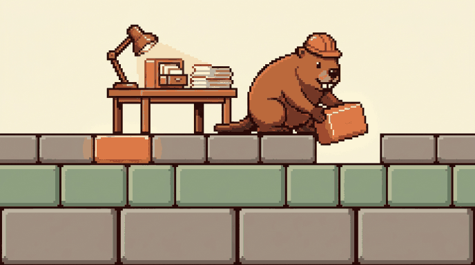

# OS-nowa

<p align="center">
  
</p>

<p align="center">
  <b>Your context in one folder, arranged so a coding agent can actually read it.</b><br>
  <sub>Plain markdown on your own machine. No account, no key, no cloud.</sub>
</p>

The better the context an agent has, the better the work it gives back. OS-nowa is where that
context lives, and it gets more useful the longer you use it.

## Install

One command. It puts the folder in your home directory, cuts it loose from this repository so the
history inside it is yours, and opens your agent in it:

```bash
git clone https://github.com/surfstories/os-nowa.git ~/os-nowa && cd ~/os-nowa && git remote remove origin && claude
```

Then say **"set me up"**, in whatever language you speak. Setup is a conversation of about ten
minutes with no commands to type, and the agent answers in your language from its first reply. There
is no account to make and no key to paste.

Using something other than Claude Code: replace the last word with `codex`, `cursor-agent` or
`gemini`. Want the folder somewhere else: change both paths.

## What is inside

- **Three levels of memory.** A small always-loaded layer, a catalog per subject, and the material
  itself opened one file at a time. The agent never reads everything to answer something.
- **Four loops, running by default.** Knowledge filed by subject and catalogued. Tasks in one file,
  open items only. Projects specced before they are built. Decisions appended, never rewritten.
- **Six things to ask for, in ordinary words.** No slash, no menu, no syntax.
- **Yours to keep.** Plain markdown, local git history as your undo, and nothing addressed to
  another person is sent without you seeing it first.

## What it looks like

```
os-nowa/
├── me/            who you are, what you are working toward, what this can reach
├── tasks.md       open items only
├── decisions.md   append-only: what you settled, and why
├── projects/      one folder each, spec before build
├── <subject>/     any area you keep material on
│   ├── index.md   the catalog: read first, it says which page is worth opening
│   ├── log.md     append-only, newest at the bottom
│   ├── sources/   raw material you handed over. Read, never edited.
│   └── pages/     what the agent wrote: summaries, notes, syntheses
└── system/        the rules the folder runs on
```

`me/` is the always-loaded level, `index.md` is the catalog, and everything else is opened only when
it is needed. That split is what keeps the folder answerable once it holds a year of your material.

## What you can ask for

| Say something like | What it does |
|---|---|
| "set me up" | First-time setup. Ten minutes, as a conversation. |
| "how does this work?" | Explains any part of it, at any moment. |
| "check my system" | Tells you whether anything has drifted. |
| "level up" | Turns one weekly chore into something automatic. |
| "show me this visually" | Turns what you are looking at into a page in your browser, where you can mark up the part that is wrong and send the note straight back. |
| "make this a command" | Creates a new one of these. Claude Code only. |

Their short names work too, if you would rather type one word: `onboard`, `explain`, `os-health`,
`level-up`, `lavish`, `create-skill`.

## Why I built this

Every session with an agent started the same way: who I am, what I do, what I am trying to get done.
To avoid saying it a third time I would go and find the old chat where I had already said it, and
carry on in there. My context was not a memory. It was a set of browser tabs whose location I had to
remember.

The second problem was next-door projects. When two of them overlapped I had to dictate the overlap
by hand every time: what touches what, why it matters, which file to open. Nothing in the projects
themselves said any of that, so nothing could be picked up on its own.

The third was the agents. Left to decide for themselves, they wrote my context down a different way
each time: this project in one shape, the next in another. No single note was wrong, and nothing
could be found twice.

So I made a folder, and I wrote the rules for how things get into it. That is what OS-nowa is.

## Which agents it runs on

| Agent | Status |
|---|---|
| **Claude Code** | **Tested.** Install and setup run end to end, from a cold command to a finished workspace. |
| **Codex** (v0.146.0) | **Measured.** Asked "what should I focus on today", a fresh session opened the three `me/` files unprompted and answered from them. Three runs out of three. |
| Cursor, Gemini CLI | Follow the same convention, **not measured.** Treat as likely, not proven. |

`AGENTS.md` is the file coding agents read by convention, and the commands are written procedures in
`system/procedures/`, so the structure and the rules travel. One exception: *"make this a command"*
writes a Claude Code skill file, so it, and anything you create with it, is Claude Code only.

## Limits worth knowing before you start

- **Nothing leaves your machine unless you ask for it by name.** Emails, messages and posts are
  drafted and shown to you. The agent does not send.
- **Your undo is the local git history**, and you will not be committing to it, so assume anything
  written since has none. The agent never deletes: it moves to `_trash/`.
- **No secrets belong in the folder.** No passwords, no keys, no tokens, anywhere in it.
- **One part needs Node.** *"Show me this visually"* serves the page through
  [`lavish-axi`](https://www.npmjs.com/package/lavish-axi), an MIT tool by Kun Chen. Without Node
  everything else works the same and that one step is skipped. The page is served locally, and
  publishing it is a separate thing you have to ask for.

## Documentation

| | |
|---|---|
| [`AGENTS.md`](./AGENTS.md) | What the agent reads: the levels, the loops, the hard rules, the routing |
| [`system/tiers.md`](./system/tiers.md) | Why three levels, and why the always-loaded one stays small |
| [`system/conventions.md`](./system/conventions.md) | Where a new thing goes, and what a catalog row has to say |
| [`system/learn/`](./system/learn/) | Walkthroughs: the first week, adding a subject area |
| [`system/procedures/`](./system/procedures/) | The commands written out. Five of the six are here; *create-skill* is a skill file only. |
| [`system/maintaining.md`](./system/maintaining.md) | Rules for changing OS-nowa itself |
| [`CHANGELOG.md`](./CHANGELOG.md) | The version you are on, and what changed in it |

## Licence and author

**MIT** - free to use, modify and distribute, including commercially, for anyone, with no fee and no
permission needed. The full text is in [LICENSE](LICENSE).

Built by **George Kachanouski**.

- LinkedIn - https://www.linkedin.com/in/georgekachanouski
- Facebook - https://www.facebook.com/george.kachanouski
